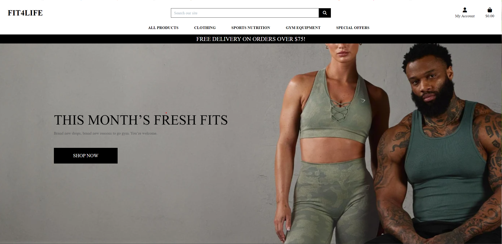

<h1 style="text-align: center">Fit4Life</h1>

This is my submission for Milestone project 4. The Fit4life website allows access to health and wellness, sportswear, and accessories retailers. Offering gym clothing and equipments that are not just stylish and trendy, but comfortable, durable and perfect for your workout sessions.

### User Experience (UX) ###

* As a customer, I want to be able to search for products by category or keyword, so I can easily find and purchase the items I am interested in.

* As a customer, I want to be able to add products to my shopping cart, view the contents of my cart, and proceed to checkout, so I can complete my purchase quickly and easily.

* As a customer, I want to be able to create an account, save my payment information, and view my order history, so I can have a personalized shopping experience and easily track my purchases.

* As a customer, I want to be able to view product details, including images, descriptions, prices, and customer reviews, so I can make informed purchasing decisions.

* As a customer, I want to receive email notifications about my order status, including order confirmation, shipping updates, and delivery notifications, so I can stay informed about my purchases.

* As a store owner, I want to be able to manage my product inventory, update product details, and track sales and revenue, so I can effectively manage my online store and make data-driven decisions about my business.

* As an Admin user the navigation bar is displayed with a logo on all pages for easy navigation, with a burger menu on mobile devices.

* As an Admin user I can add, delete and edit categories and products.

### Design ###

* WireFrames:
Desktop wireframe.

## Features
There are universal features that are present throughout The Fit4life website. These feature are:
- Responsive on all device sizes - from 320px upwards to larger desktops reaching 1200px and more.
- Fully-responsive nav bar (including mobile nav bar)
- Mobile-friendly, adusting automatically at specific breakpoints thanks to Bootstrap easy-to-use framework and custom overriding style classes.
- The Fit4life logo/name is seen at all times whether tucked to the left, central on reduced screen-sizes or at the top of the mobile menu on smaller and mobile devices. This is vital for brand consistency and serves as a simple way of reminding the user of the website's name. The logo is clickable and always takes the user to The Cocktail Cabinet home page (home.html).
- Clear and obvious navbar links to other pages within the website.
- All clickable images, buttons, links etc have a hovering cursor to signify that that element can be interacted with. 
- A Flash text "Toast" appears at the top of the webpage whenever a user or admin completes a task - by either adding, editing or purchasing an item. 

### Typography

Ease of use was the primary consideration for the typography. For this reason, text was kept black, save for the header which is white with shading to make sure it is properly visible (the white header was more aesthetically pleasing on the header background). Lato was used as the primary font. This ensured that the typography was simple, familiar and easy to read so that users could navigate the application easily.

### Technologies: ###

- Stripe: 
- GitHub: [https://github.com/](https://github.com/)
  - GitHub was used to host the applications repositories.
- GitPod: [https://www.gitpod.io/](https://www.gitpod.io/)
  - GitPod served as the integrated development environment used to code the site.
- HTML: [https://developer.mozilla.org/en-US/docs/Web/HTML](https://developer.mozilla.org/en-US/docs/Web/HTML)
  - The website uses HTML to input the structure and content.
- CSS: [https://developer.mozilla.org/en-US/docs/Web/CSS](https://developer.mozilla.org/en-US/docs/Web/CSS)
  - The website uses CSS to style the HTML elements.
- Bootstrap 4: [https://getbootstrap.com/](https://getbootstrap.com/)
  - The website uses the Bootstrap 4 framework to simplify the integration and styling of responsive elements.
- JavaScript: [https://developer.mozilla.org/en-US/docs/Web/JavaScript](https://developer.mozilla.org/en-US/docs/Web/JavaScript)
  - The site uses JavaScript to enable interactive user events and to incorporate features from the following APIs: Google Maps JavaScript API, Google Maps Embed API.
- EmailJS: [https://www.emailjs.com/](https://www.emailjs.com/)
  - EmailJS was use to link the contact form on contact.html to a functioning email account.
- Google Fonts: [https://fonts.google.com/](https://fonts.google.com/)
  - The site uses Google Fonts to integrate the Lato font into the website.
- Fontawesome: [https://fontawesome.com/](https://fontawesome.com/)
  - The site uses Font Awesome to integrate social media icons into the footer.

<h2 style="text-align: center">Testing</h2>

The W3C Markup Validator, W3C CSS and JSHint Validator Services were used to validate the project pages to ensure
there were no syntax errors.

* [W3C Markup validator](https://validator.w3.org/#validate_by_input)
No errors were returned from the HTML validator.

* [W3C CSS validator](https://jigsaw.w3.org/css-validator/validator)
No errors were returned from the CSS validator

* [JSHint](https://jshint.com/)
No errors or warnings shown

* [Lighthouse](https://developer.chrome.com/docs/lighthouse/overview/)

### General Testing
- Each feature was developed and tested in its own branch before being merged with master. Branches were subsequently deleted.
- Each time a feature was added, all the functions were tested to see if there was an impact.
- The site was sent to friends for feedback and testing.
- All forms have validation and will not submit without the proper information.
- .gitignore file has been included to prevent system file commits.
- The image loading blur has been thoroughly tested and gone through numerous iterations to optimise the smoothness of the transition on different devices and internet speeds.
- Backup Map functions have been tested in a local deployment.
- Email error functions have been tested offline as well.
- External links open in a new tab.

### Mobile Testing
- I tested the site personally on my Android device, going through the entire process, checking buttons, functions, checking out, etc. I was personally unable to test on iOS.
- The site was sent to friends and relatives for them to follow the same process. They have tested on their devices, including iOS.
- Chrome was utilised to inspect the site in mobile format, going through the pages and functions.

### Desktop Testing
- The site was developed on a Chromebook and, as such, the majority of testing occurred on Chrome.
- The site was tested by friends and relatives on numerous desktop devices.
- The site was marginally tested on other browsers, such as Firefox and Edge.
- Internet Explorer was not tested and the site was not developed with it in mind as support for the browser is gradually being dropped.

<h2 style="text-align: center">Deployment</h2>

### GitHub Pages ###
The project was deployed to GitHub Pages using the following steps...

#### Log in to GitHub and locate the GitHub Repository ####

* At the top of the repository section, locate the "Settings" Button on the menu.
* Scroll down the settings page until you find the "GitHub Pages" section.
* You will see a message "Pages settings now has its own dedicated tab! Check it out here!" click on the link.
* Under "Source", click the dropdown and select "Master Branch".The page will refresh.
* The now published site link in the "GitHub Pages" section will be found at the top of the page.

### Forking the GitHub Repository ###
By forking the GitHub Repository we make a copy of the original repository on our GitHub account to view and/or make changes without affecting the original repository by using the following steps...

#### Log in to GitHub and locate the GitHub Repository ####

* At the top of the repository section just above the "Settings" button on the menu, click the "Fork" button.
  The original repository in your GitHub account should now have duplicated.

#### Making a Local Clone ####

* Log in to GitHub and locate the GitHub repository, under the repository name, click "clone or download".
* To clone the repository using HTTPS, under "Clone with HTTPS", copy the link.
* Open Git Bash
* Change the current working directory to the location where you want the cloned directory to be made.
* Type git clone, and then paste the URL you copied in Step 2.
   * $ git clone https://github.com/YOUR-USERNAME/YOUR-REPOSITORY
* Press Enter. Your local clone will be created.
   * $ git clone https://github.com/YOUR-USERNAME/YOUR-REPOSITORY
> Cloning into `CI-Clone`...
> remote: Counting objects: 10, done.
> remote: Compressing objects: 100% (8/8), done.
> remove: Total 10 (delta 1), reused 10 (delta 1)
> Unpacking objects: 100% (10/10), done.

### Creating a Database with ElephantSQL
1. Log in with GitHub to the ElephantSQL.
2. Create new team.
3. Click 'Create New Instance'.
4. Choose your plan.
5. Select your region.
6. Click 'Review'.
7. Click 'Create instance'.
8. Click on the name of your database and copy the URL to your clickboard.

### Creating a Heroku app
1. Type `pip3 freeze --local > requirements.txt` into the Gitpod terminal to create a requirements.txt file.
2. Type `echo web: python app.py > Procfile` into the terminal to create a Procfile.
3. Commit and push the changes to Github.
4. Login to your Heroku Account.
5. Click 'New' -> 'Create new app'.
6. Enter a name for your project and select your region.
7. Click 'Create app'.
8. Go to 'Settings', click 'Reveal Config Vars'.
9. Add the following variables:
    * DATABASE_URL: your ElephantSQL database url
    * IP: 0.0.0.0
    * PORT: 5000
    * SECRET_KEY: your secret key
    * DEBUG: True
10. Click on the 'Deploy' tab.
11. Click 'Connect to Github'.
12. Find your depo and click 'Connect'
13. Click 'Deploy Branch'.
14. Click 'More' -> 'Run console'
15. Type in `python3`
16. Type `from fit4life import db` -> `db.create_all()` -> `exit().`
17. Click 'Open App'.

<h2 style="text-align: center">Credits</h2>

#### Credits ####

* [Unsplash.com](https://unsplash.com/)

* [perplexity.ai](https://www.perplexity.ai/)

#### Wireframe ####

* [Lucid](https://www.lucidchart.com/pages/)